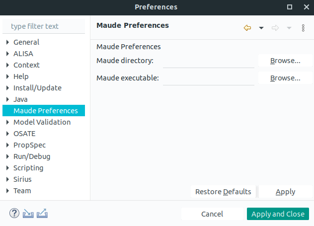

This page explains the artifact for our paper: "An Extension of HybridSynchAADL
and Its Application to Collaborating Autonomous UAVs" by J. Lee, K.  Bae, and
P. C. Ölveczky. This page includes the HybridSynchAADL tool, case study model,
and executable formal semantics.

<h2>Complete AADL Specification for the Case Study</h2>

The HybridSynchAADL model of the packet delivery system example from out paper
is provided below.  The archive file contains AADL source code (in packages
directory) and the requirement specification (in requirements directory).

* <a href="https://www.dropbox.com/sh/yqdb2vkkf2clhti/AACCsILskApL3s8MsBHN52sPa?dl=0">model.zip</a>

We also defines an executable formal semantic for this case study. 

* <a href="https://www.dropbox.com/sh/yqdb2vkkf2clhti/AACCsILskApL3s8MsBHN52sPa?dl=0">semantics.zip</a>

<h2>The HybridSynchAADL Tool</h2>

To install our hybridsynchaadl tool, download and unzip the following archive files:
<a href="https://www.dropbox.com/sh/yqdb2vkkf2clhti/AACCsILskApL3s8MsBHN52sPa?dl=0">artifact.zip</a>
The artifact requires the following libraries:

* JAVA 11+: <a href="https://openjdk.java.net/install/">https://openjdk.java.net/install/</a>
* Maude-SE: <a href="https://maude-se.github.io/">https://maude-se.github.io/</a>

In the artifact, HybridSynchAADL tool can be exeucted by double clicking 
<code>/hybridsynchaadl/osate</code>. For the workspace, use the directory
<code>/hybridsynchaadl/workspace</code>, which includes a HybridSynchAADL model
<code>PacketDeliverySystem</code>. You also need to set the Maude path: in the top menu, go to
<code>Window => Preferences => Maude Preferences</code>, and fill the Maude directory and
executable Maude file.

<figure>

<figcaption style="font-size: 14px">Workspace</figcaption>
</figure>
<figure>

<figcaption style="font-size: 14px">Maude Preferences</figcaption>
</figure>

 
 
