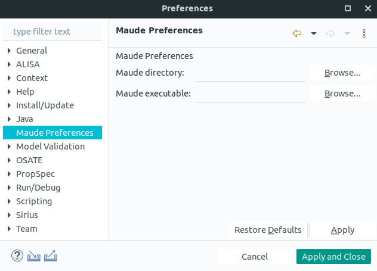

This page explains the artifact for our paper: 
"Rigorous Model Engineering of Multirate CPSs in Multirate HybridSynchAADL"
by J. Lee, K.  Bae, and P. C. Ölveczky. This page includes the 
MR-HybridSynchAADL tool, case study model, and executable formal semantics.

## Complete AADL Specification for the Case Study ##

The MR-HybridSynchAADL model of the packet delivery system example from out paper
is provided below. The archive file contains AADL source code (in packages
directory) and the requirement specification (in requirements directory).

* <a href="https://www.dropbox.com/sh/o7f2igk8s0zktu5/AAD8TApEPw_ecr2-m_6bRMlqa?dl=0">model.zip</a>

## Formal Semantics for MR-HybridSynchAADL ##

We also defines an executable formal semantic for this case study. This
semantics is significantly adapted from <a href="https://hybridsynchaadl.github.io/artifact/isola2022/sttt-paper.pdf">this paper</a> and extended to deal
with array data types, arrays of components and ports, and subprograms.

* <a href="https://www.dropbox.com/sh/sg2yi2a46ipm2lj/AAAPWFSfJKq1LIvFJ7e0wOtqa?dl=0">semantics.zip</a>

<h2>The MR-HybridSynchAADL Tool</h2>

To install our MR-HybridSynchAADL tool, download and unzip the following archive files:
<a href="https://www.dropbox.com/sh/rqhw6v8zgyxso84/AADPsfTjIGR8gFxClVxtIRKja?dl=0">tool.zip</a>
The MR-HybridSynchAADL tool requires the following libraries:

* JAVA 11+: <a href="https://openjdk.java.net/install/">https://openjdk.java.net/install/</a>
* Maude-SE: <a href="https://maude-se.github.io/">https://maude-se.github.io/</a>

In the artifact, MR-HybridSynchAADL tool can be exeucted by double clicking 
<code>/hybridsynchaadl/osate</code>. For the workspace, use the directory
<code>/hybridsynchaadl/workspace</code>, which includes a MR-HybridSynchAADL model
<code>PacketDeliverySystem</code>. You also need to set the Maude path: in the top menu, go to
<code>Window => Preferences => Maude Preferences</code>, and fill the Maude directory and
executable Maude file.

<figure>

<figcaption style="font-size: 14px">Maude Preferences</figcaption>
</figure>

 
 
