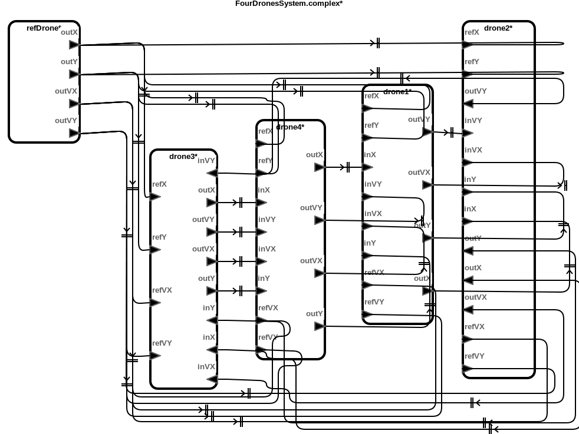
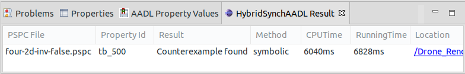

# Drone Formation Models with Double-Integrator Dynamics


This benchmark models represent the formation control of distributed drones
with double-integrator dynamics. Each drone communicates its own position and
velocity sets a proper acceleration. The goal of these models is for all
drones maintains a formation tracing the reference drone without any collision.

## Download
You can download the benchmark models: [Drone_Formation_Double.zip](../Drone_Formation_Double.zip)

## Top-Level Components
We provide six cases of benchmark model: two, three and four drone components
moving in one or two dimensional plane.


## Architecture


## HybridSynchAADL Model: Controller and Environment
Controller.aadl
```
thread Drone1DControlThread
  features
    currX: in data port Base_Types::Float;
    currVX: in data port Base_Types::Float;
    inX: in data port Base_Types::Float;
    inVX: in data port Base_Types::Float;
    outX : out data port Base_Types::Float;
    outVX: out data port Base_Types::Float;
    accX: out data port Base_Types::Float;
    refX: in data port Base_Types::Float;
    refVX: in data port Base_Types::Float;
  properties
    Dispatch_Protocol => Periodic;
end Drone1DControlThread;
thread implementation Drone1DControlThread.impl
  subcomponents
    offsetX: data Base_Types::Float;
    refVX0: data Base_Types::Float {Data_Model::Initial_Value => ("0");};
  annex behavior_specification {**
    variables
      nx, refaX : Base_Types::Float;
    states
      init : initial complete state;
      exec, output : state;
    transitions
      init -[on dispatch]-> exec;
            exec -[abs(currX - inX) < 0.3]-> output{
              accX := -currVX
            };
            exec -[otherwise]-> output {
                 refaX := (refVX - refVX0);
                 nx := refaX - #DroneSpec::alpha * (currX - offsetX - refX + #DroneSpec::gamma * (currVX - refVX))
                      - #DroneSpec::A * (currX - offsetX - inX + #DroneSpec::gamma * (currVX - inVX));
        if (nx > 0.5)    accX := 40
        elsif (nx > 0)    accX := 0
        else        accX := -40
        end if
             };
            output -[ ]-> init {
                outX := currX - offsetX;
                outVX := currVX;
                 refVX0 := refVX
           };
**};
end Drone1DControlThread.impl;

thread Drone2DControlThread extends Drone1DControlThread
  features
    currY: in data port Base_Types::Float;
    currVY: in data port Base_Types::Float;
    inY: in data port Base_Types::Float;
    inVY: in data port Base_Types::Float;
    outY : out data port Base_Types::Float;
    outVY: out data port Base_Types::Float;
    accY: out data port Base_Types::Float;
    refY: in data port Base_Types::Float;
    refVY: in data port Base_Types::Float;
  properties
    Dispatch_Protocol => Periodic;
    Classifier_Substitution_Rule => Type_Extension;
end Drone2DControlThread;
thread implementation Drone2DControlThread.impl extends Drone1DControlThread.impl
  subcomponents
    offsetY: data Base_Types::Float;
    refVY0: data Base_Types::Float {Data_Model::Initial_Value => ("0");};
  annex behavior_specification {**
    variables
      nx, ny, refaX, refaY : Base_Types::Float;
    states
      init : initial complete state;
      exec, output : state;
    transitions
      init -[on dispatch]-> exec;
            exec -[abs(currX - inX) < 0.3 and abs(currY - inY) < 0.3]-> output{
              accX := -currVX; accY := -currVY
            };
            exec -[otherwise]-> output {
                 refaX := (refVX - refVX0);
                 nx := refaX - #DroneSpec::alpha * (currX - offsetX - refX + #DroneSpec::gamma * (currVX - refVX))
                      - #DroneSpec::A * (currX - offsetX - inX + #DroneSpec::gamma * (currVX - inVX));
                 refaY := (refVY - refVY0);
                 ny := refaY - #DroneSpec::alpha * (currY- offsetY - refY + #DroneSpec::gamma * (currVY - refVY))
                      - #DroneSpec::A * (currY - offsetY - inY + #DroneSpec::gamma * (currVY - inVY));
        if (nx > 0.5)    accX := 40
        elsif (nx > 0)    accX := 0
        else        accX := -40
        end if;
        if (ny > 0.5)    accY := 40
        elsif (ny > 0)    accY := 0
        else        accY := -40
        end if
             };
            output -[ ]-> init {
                outX := currX - offsetX;
                outVX := currVX;
                 refVX0 := refVX;
                outY := currY - offsetY;
                outVY := currVY;
                 refVY0 := refVY
           };
**};
end Drone2DControlThread.impl;
```
Environment.aadl
```
system Environment1D
  features
    currX : out data port Base_Types::Float;
    currVX : out data port Base_Types::Float;
    accX : in data port Base_Types::Float;
  properties
    Hybrid_SynchAADL::isEnvironment => true;      
end Environment1D;
system implementation Environment1D.impl
  subcomponents
    x : data Base_Types::Float;
    dotx : data Base_Types::Float;
    dotdotx : data Base_Types::Float;
  connections
    C1: port dotx -> currVX;
    C2: port x -> currX;
    C3: port accX -> dotdotx;
  properties
    Hybrid_SynchAADL::ContinuousDynamics =>
        "dotx(t) = ((0.001) * dotdotx * t) + dotx(0); 
               x(t) = (x(0) + (0.001 * dotx(0) * t) + ((0.000001) * dotdotx * t * t) / 2) ; ";
end Environment1D.impl;

system Environment2D extends Environment1D
  features
    currY : out data port Base_Types::Float;
    currVY : out data port Base_Types::Float;
    accY : in data port Base_Types::Float;
  properties
    Hybrid_SynchAADL::isEnvironment => true;
end Environment2D;
system implementation Environment2D.impl extends Environment1D.impl
  subcomponents
    y : data Base_Types::Float;
    doty : data Base_Types::Float;
    dotdoty : data Base_Types::Float;
  connections
    C4: port doty -> currVY;
    C5: port y -> currY;
    C6: port accY -> dotdoty;
  properties
    Hybrid_SynchAADL::ContinuousDynamics =>
        "dotx(t) = ((0.001) * dotdotx * t) + dotx(0); 
               x(t) = (x(0) + (0.001 * dotx(0) * t) + ((0.000001) * dotdotx * t * t) / 2);
        doty(t) = ((0.001) * dotdoty * t) + doty(0); 
               y(t) = (y(0) + (0.001 * doty(0) * t) + ((0.000001) * dotdoty * t * t) / 2); ";
end Environment2D.impl;
```


## Safety Requirement

We analyze the safety invariant property where drones do not collide up to
bound 500 ms.

four-2d-inv-false.pspc:
```
proposition [initial] : abs(drone1.env.x - 0.0) < 0.01 and abs(drone1.env.y - 0.0) < 0.01 and
			abs(drone2.env.x - 0.6) < 0.01 and abs(drone2.env.y - 0.6) < 0.01 and
			abs(drone3.env.x - 1.8) < 0.01 and abs(drone3.env.y - 1.8) < 0.01 and
			abs(drone4.env.x - 2.7) < 0.01 and abs(drone4.env.y - 2.7) < 0.01 ;

proposition [someClose] : (abs(drone1.env.x-drone2.env.x)<0.5 and abs(drone1.env.y-drone2.env.y)<0.5) or
			  (abs(drone1.env.x-drone3.env.x)<0.5 and abs(drone1.env.y-drone3.env.y)<0.5) or
			  (abs(drone1.env.x-drone4.env.x)<0.5 and abs(drone1.env.y-drone4.env.y)<0.5) or
			  (abs(drone2.env.x-drone3.env.x)<0.5 and abs(drone2.env.y-drone3.env.y)<0.5) or
			  (abs(drone2.env.x-drone4.env.x)<0.5 and abs(drone2.env.y-drone4.env.y)<0.5) or
			  (abs(drone3.env.x-drone4.env.x)<0.5 and abs(drone3.env.y-drone4.env.y)<0.5);

invariant [tb_500] : ?initial ==> not(?someClose) in time 500;
```

## Analysis Results


<br />
<br />
