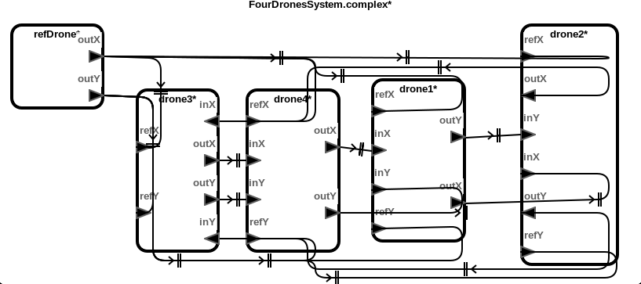
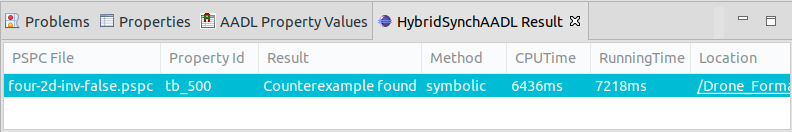

# Drone Formation Models with Single-Integrator Dynamics

This benchmark models represent the rendezvous control of distributed drones
with single-integrator dynamics. Each drone communicates its own position and
sets a proper velocity. The goal of these models is for all drones maintains a
formation tracing the reference drone without any collision.

### Download
You can download the benchmark model: [Drone_Formation_Single.zip](../Drone_Formation_Single.zip)

## Top-Level Components
We provide six cases of benchmark model: two, three and four drone components
moving in one or two dimensional plane.

## Architecture



## HybridSynchAADL Model: Controller and Environment
Controller.aadl
```
thread Drone1DControlThread
  features
    inX: in data port Base_Types::Float;
    outX : out data port Base_Types::Float;
    currX: in data port Base_Types::Float;
    velX : out data port Base_Types::Float;
    refX: in data port Base_Types::Float;
  properties
    Dispatch_Protocol => Periodic;
end Drone1DControlThread;
thread implementation Drone1DControlThread.impl
  subcomponents
    offsetX: data Base_Types::Float;
    refX0: data Base_Types::Float {Data_Model::Initial_Value => ("0");};
  annex behavior_specification {**
    variables
      nx, refvX : Base_Types::Float;
    states
      init : initial complete state;
      exec, output : state;
    transitions
      init -[on dispatch]-> exec;
      exec -[abs(currX - inX) < 0.1]-> output {
        velX := 0
      };
      exec -[otherwise]-> output {
        refvX := (refX-refX0);
        nx := refvX - #DroneSpec::alpha * (currX - offsetX - refX) - #DroneSpec::A * (currX - offsetX - inX);
        if (nx > 1)      velX := 2
        elsif (nx > -0.5)  velX := 0
        else        velX := -2
        end if
      };
      output -[ ]-> init {
        outX := currX - offsetX;
        refX0 := refX
      };
**};
end Drone1DControlThread.impl;  

thread Drone2DControlThread extends Drone1DControlThread
  features
    inY: in data port Base_Types::Float;
    outY : out data port Base_Types::Float;
    currY: in data port Base_Types::Float;
    velY : out data port Base_Types::Float;
    refY: in data port Base_Types::Float;
  properties
    Dispatch_Protocol => Periodic;
end Drone2DControlThread;
thread implementation Drone2DControlThread.impl extends Drone1DControlThread.impl
  subcomponents
    offsetY: data Base_Types::Float;      
    refY0: data Base_Types::Float {Data_Model::Initial_Value => ("0");};      
  annex behavior_specification {**
    variables
      nx, ny, refvX, refvY : Base_Types::Float;
    states
      init : initial complete state;
      exec, output : state;
    transitions
      init -[on dispatch]-> exec;
      exec -[abs(currX - inX) < 0.1 and abs(currY - inY) < 0.1]-> output {
        velX := 0; velY := 0
      };
      exec -[otherwise]-> output {
        refvX := (refX-refX0);
        refvY := (refY-refY0);
        nx := refvX - #DroneSpec::alpha * (currX - offsetX - refX) - #DroneSpec::A * (currX - offsetX - inX);
        ny := refvY - #DroneSpec::alpha * (currY - offsetY - refY) - #DroneSpec::A * (currY - offsetY - inY);
        if (nx > 1)      velX := 2
        elsif (nx > -0.5)  velX := 0
        else        velX := -2
        end if;
        if (ny > 1)      velY := 2
        elsif (ny > -0.5)  velY := 0
        else        velY := -2
        end if          
      };
      output -[ ]-> init {
        outX := currX - offsetX;
        outY := currY - offsetY;
        refX0 := refX;
        refY0 := refY
      };
**};
end Drone2DControlThread.impl;
```

Environment.aadl
```
system Environment1D
  features
    currX : out data port Base_Types::Float;    
    velX : in data port Base_Types::Float;
  properties
    Hybrid_SynchAADL::isEnvironment => true;
end Environment1D;
system implementation Environment1D.impl
  subcomponents
    x : data Base_Types::Float;
    dotx : data Base_Types::Float;
  connections
    C1: port x -> currX;
    C2: port velX -> dotx;
  properties
    Hybrid_SynchAADL::ContinuousDynamics =>
     "x(t) = ((0.001) * dotx * t) + x(0);";
end Environment1D.impl;

system Environment2D extends Environment1D
  features
    currY : out data port Base_Types::Float;    
    velY : in data port Base_Types::Float;
  properties
    Hybrid_SynchAADL::isEnvironment => true;
    Classifier_Substitution_Rule => Type_Extension;      
end Environment2D;
system implementation Environment2D.impl extends Environment1D.impl
  subcomponents
    y : data Base_Types::Float;
    doty : data Base_Types::Float;
  connections
    C3: port y -> currY;
    C4: port velY -> doty;
  properties
    Hybrid_SynchAADL::ContinuousDynamics =>
     "x(t) = ((0.001) * dotx * t) + x(0); y(t) = ((0.001) * doty * t) + y(0);";
end Environment2D.impl;
```

## Safety Requirement

We analyze the safety invariant property where drones do not collide up to
bound 500 ms.
four-2d-inv-false.pspc
```
proposition [initial] : abs(drone1.env.x - 0.2) < 0.1 and abs(drone1.env.y - 0.2) < 0.1 and
			abs(drone2.env.x - 1.4) < 0.1 and abs(drone2.env.y - 1.4) < 0.1 and
			abs(drone3.env.x - 2.1) < 0.1 and abs(drone3.env.y - 2.1) < 0.1 and
			abs(drone4.env.x - 5.7) < 0.1 and abs(drone4.env.y - 5.7) < 0.1 and
			abs(refDrone.env.x - 1.7) < 0.1 and abs(refDrone.env.y - 1.7) < 0.1;

proposition [someClose] : (abs(drone1.env.x-drone2.env.x)<0.3 and abs(drone1.env.y-drone2.env.y)<0.3) or
			  (abs(drone1.env.x-drone3.env.x)<0.3 and abs(drone1.env.y-drone3.env.y)<0.3) or
			  (abs(drone1.env.x-drone4.env.x)<0.3 and abs(drone1.env.y-drone4.env.y)<0.3) or
			  (abs(drone2.env.x-drone3.env.x)<0.3 and abs(drone2.env.y-drone3.env.y)<0.3) or
			  (abs(drone2.env.x-drone4.env.x)<0.3 and abs(drone2.env.y-drone4.env.y)<0.3) or
			  (abs(drone3.env.x-drone4.env.x)<0.3 and abs(drone3.env.y-drone4.env.y)<0.3);

invariant [tb_500] : ?initial ==> not(?someClose) in time 500;
```

## Analysis Results


<br />
<br />
