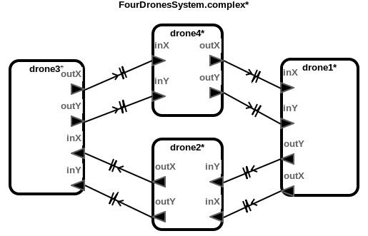
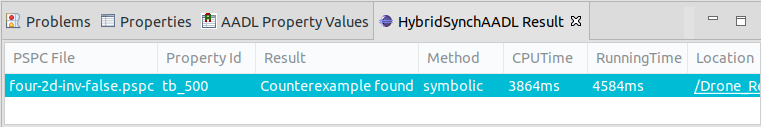

# Drone Formation Models with Single-Integrator Dynamics

This benchmark models represent the rendezvous control of distributed drones
with single-integrator dynamics. Each drone communicates its own position and
sets a proper velocity. The goal of these models is for all drones maintains a
formation tracing the reference drone without any collision.

### Download
You can download the benchmark model: [Drone_Formation_Single.zip](../Drone_Formation_Single.zip)

## Top-Level Components
We provide six cases of benchmark model: two, three and four drone components
moving in one or two dimensional plane.

## Architecture



## HybridSynchAADL Model: Controller and Environment
Controller.aadl

## Safety Requirement

We analyze the safety invariant property where drones do not collide up to
bound 500 ms.
four-2d-inv-false.pspc
```
```

## Analysis Results


<br />
<br />
