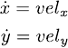

This benchmark model represents the rendezvous and formation control of
distributed drones with single-integroator dynamics. Each
drone communicates its own position and sets the proper velocity which do not
lead to collision to other drones. 

### Continuous Dynamics
The continuous dynamics of the drone component is as follows:
<p align="center">
   
</p>

### Safety Property

We verify safety invariant property which represents that drones do not collide. We analyze them up to
bound 500 ms. 

The example of PSPC file containing safety invariant property is as follows:
```
proposition [initial] : abs(drone1.environment.x - 2.8) < 0.1 and abs(drone1.environment.y - 2.8) and
                        abs(drone2.environment.x - 1.5) < 0.1 and abs(drone2.environment.y - 1.5);

proposition [twoclose] : abs(drone1.environment.x - drone2.environment.x) < 0.5 and
                         abs(drone1.environment.y - drone2.environment.y) < 0.5

invariant [tb_500]: ?initial ==> not(?twoclose) in time 500;
```

### Download
You can download the benchmark model: [Drone_Rendezvous_Single.zip](../Drone_Rendezvous_Single.zip)


<br />
<br />
