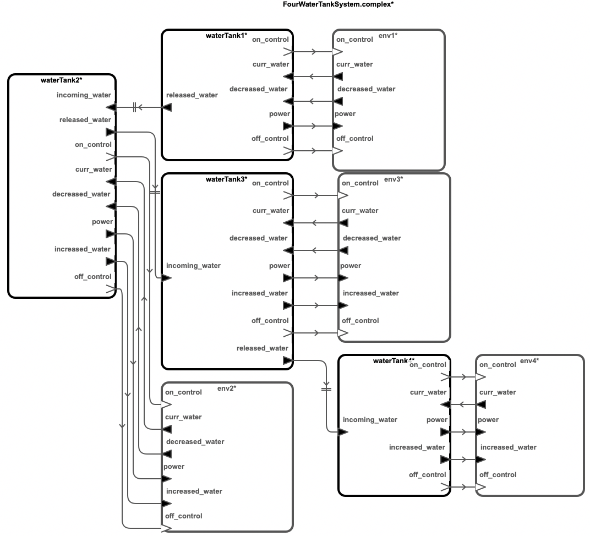
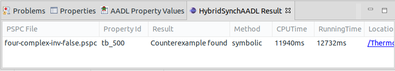

# Networked Water Tank Systems

This benchmark model represents the networked water tank benchmark. Each water
tank component communicates its amount of water to the next water tank
component and sets its power power. The goal of these models is for all water
tank to maintain the amount of water larger than certain amounts.

## Download
You can download the benchmark model: [WaterTank.zip](../watertank.zip)

## Top-Level Components
We provide six cases of benchmark model: two, three and four water tanks
with simple control logic or complex control logic. 


## Architecture


## HybridSynchAADL Model: Controller and Environment
Controller.aadl
```
thread WaterTankThread
  features
    on_control: out event port;
    off_control: out event port;
    curr_water: in data port Base_Types::Float;
    incoming_water: in data port Base_Types::Float;
    increased_water: out data port Base_Types::Float;
    released_water: out data port Base_Types::Float;
    power: out data port Base_Types::Float;  
    decreased_water: in data port Base_Types::Float;
  properties
    Dispatch_Protocol => Periodic;
end WaterTankThread;

thread implementation WaterTankThread.simple
  annex behavior_specification{**
    states
      init : initial complete state;
      exec : state;
    transitions
      init -[ on dispatch ]-> exec {
        increased_water := incoming_water;
        released_water := decreased_water  
      };
      exec -[ true ]-> init {
        if (curr_water <= 33)
          power := 0.5;
          on_control!
        elsif (curr_water <= 39)
          power := 0.3;
          on_control!
        else {
          power := 0.0;
          off_control!
        }
        end if
      };
  **};
end WaterTankThread.simple;

thread implementation WaterTankThread.complex extends WaterTankThread.simple
    annex behavior_specification{**
        states
            init : initial complete state;
            exec : state;
        transitions
            init -[ on dispatch ]-> exec {
                increased_water := incoming_water;
                released_water := decreased_water
            };
            exec -[curr_water <= 42]-> init {
                if (curr_water <= 30)
                    power := 0.5
                elsif (curr_water <= 33)
                    power := 0.4
                elsif (curr_water <= 36)
                    power := 0.3
                elsif (curr_water <= 39)
                    power := 0.2
                else {
                    power := 0.1
                }
                end if;
                on_control!
            };
            exec -[otherwise]-> init {
                off_control!
            };
    **};
end WaterTankThread.complex;
```
Environment.aadl
```
system Environment
  features
    curr_water : out data port Base_Types::Float {Data_Model::Initial_Value => ("0");};
    increased_water : in data port Base_Types::Float;
    power: in data port Base_Types::Float;
    decreased_water : out data port Base_Types::Float {Data_Model::Initial_Value => ("0");};
    on_control : in event port;
    off_control : in event port;
  properties
    Hybrid_SynchAADL::isEnvironment => true;
end Environment;

system implementation Environment.impl
  subcomponents
    water: data Base_Types::Float;
    decrease: data Base_Types::Float;
    increase: data Base_Types::Float;
    pump_power: data Base_Types::Float;
  connections
    C1: port water -> curr_water;
    C2: port increased_water -> increase;
    C3: port decrease -> decreased_water;
    C4: port power -> pump_power;
  modes
    off: initial mode;
    on: mode;
    
    off -[on_control]-> on;
    off -[off_control]-> off;
    
    on -[on_control]-> on;
    on -[off_control]-> off;
  
  properties
    Hybrid_SynchAADL::ContinuousDynamics =>
      "decrease(t) = (50 * 0.001 * t) ; water(t) = water(0) + pump_power - (50 * 0.001 * t) + increase" in modes(on),
      "decrease(t) = (50 * 0.001 * t) ; water(t) = water(0) - (50 * 0.001 * t) + increase" in modes(off);
end Environment.impl;
```


## Safety Requirement

We analyze the safety invariant property where temperature of all water tank
contains the amount of water more than 30 up to bound 500 ms. 

four-complex-inv-false.pspc
```
proposition [initial]: abs(env1.water - 55.0) < 0.1 and
			abs(env2.water - 38.5) < 0.1 and
			abs(env3.water - 44.0) < 0.1 and
			abs(env4.water - 40.0) < 0.1;

proposition [upperBound] : env1.water >= 30 and 
			   env2.water >= 30 and
			   env3.water >= 30 and
			   env4.water >= 30;							   

invariant [tb_500] : ?initial ==> ?upperBound in time 500;
```

## Analysis Results


<br />
<br />
